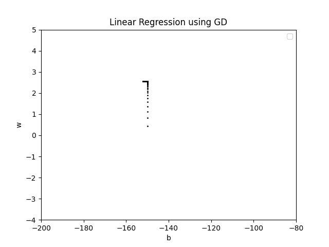
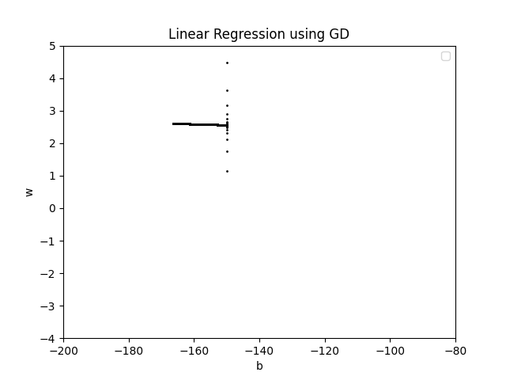
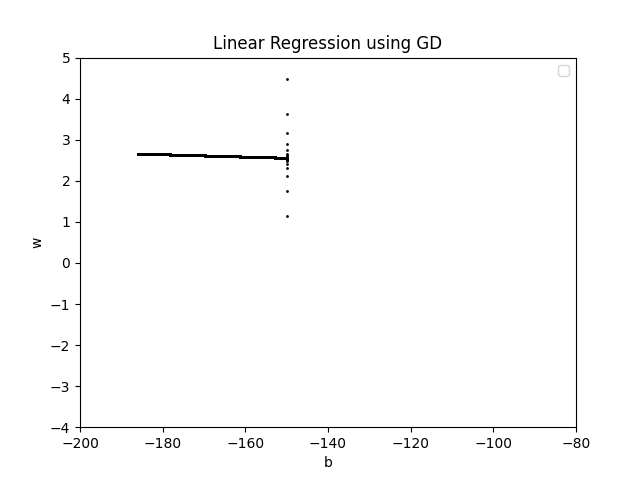
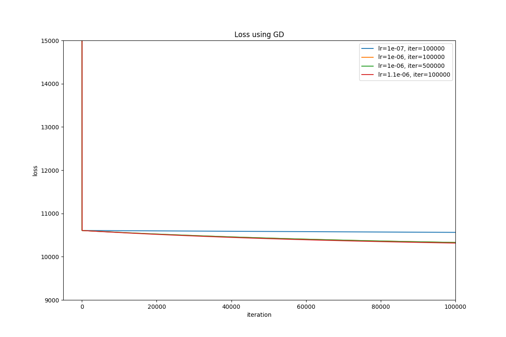
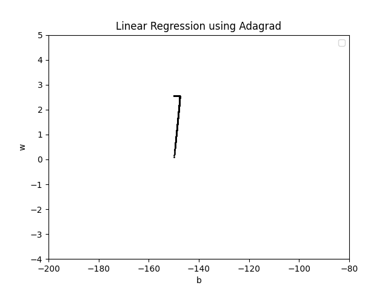
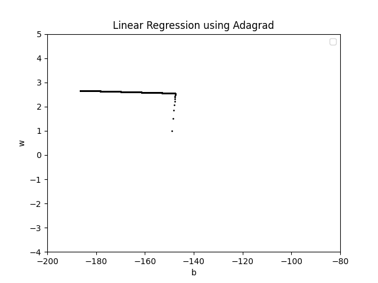
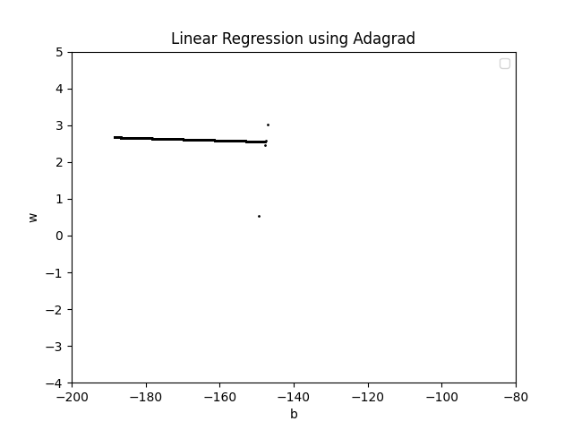
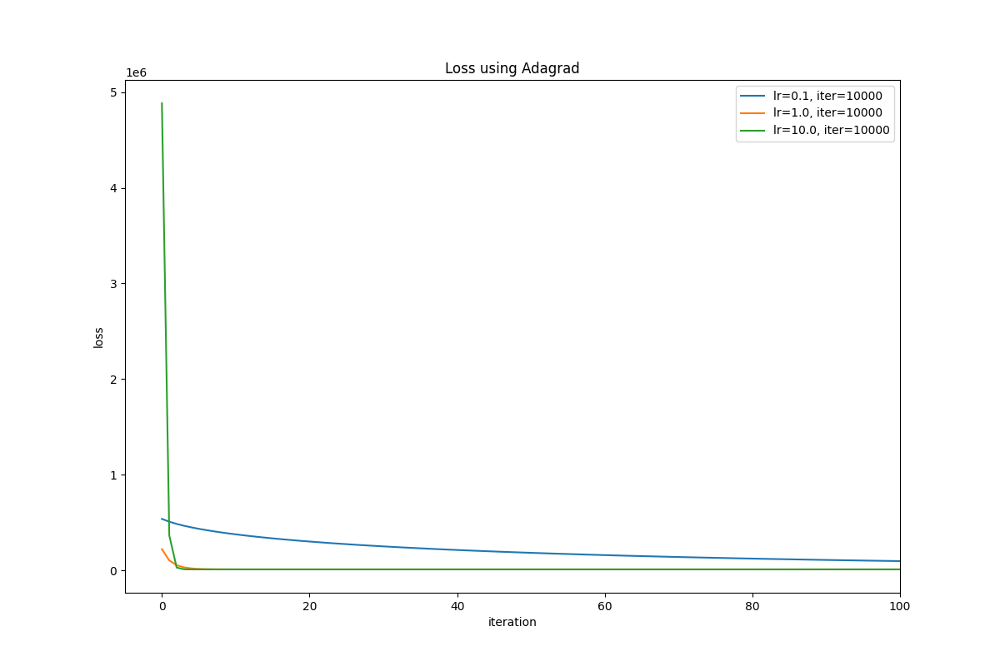

## 任务一：梯度下降算法GD和Adagrad的实现
### GD算法
本实验测试了以下几组数据，并分别绘制了对应的w-b结果图：
| 学习率 | 迭代次数 | 结果图 |
| :----: | :----: | :----: |
| 1e-07 | 100000 |  |
| 1e-06 | 100000 |  |
| 1e-06 | 500000 |  |
| 1.1e-06 | 100000 |  |

同时，还得到了不同组数据下loss函数随迭代次数的变化，如图所示

### Adagrad算法
本实验测试了以下几组数据，并分别绘制了对应的w-b结果图：
| 学习率 | 迭代次数 | 结果图 |
| :----: | :----: | :----: |
| 0.1 | 10000|  |
| 1.0 | 10000 |  |
| 10.0 | 10000 |  |

同时，还得到了不同组数据下loss函数随迭代次数的变化，如图所示

### 超参数选择的思考逻辑
1. 学习率：学习率过大会导致梯度下降算法在最优点附近震荡，而学习率过小会导致梯度下降算法收敛速度过慢。因此，需要根据实际情况选择合适的学习率。
2. 迭代次数：迭代次数过少会导致梯度下降算法未能收敛，而迭代次数过多会导致梯度下降算法过拟合。因此，需要根据实际情况选择合适的迭代次数。

### 开放性问题：梯度下降算法和Adagrad算法中参数设置对算法性能的影响
梯度下降算法和Adagrad算法的性能受参数设置影响显著。学习率决定了每次更新的步长，过大会导致震荡，过小则收敛缓慢。迭代次数影响算法的收敛程度，过少可能未收敛，过多则可能过拟合。选择合适的参数需结合具体问题和数据进行调整。

## 任务二：选择题

### 解答

选择 **A选项：全局最大值**

### 解析

`L(β)`为严格凹函数，其负函数`F(β)`为严格凸函数。对原函数进行梯度上升等同于对`F(β)`进行梯度下降，而结果会是收敛到`F(β)`的局部最小值，而由于其为严格凸函数，则该局部最小值也为全局最小值。

进一步的可得到，对于`L(β)`进行梯度上升会收敛到其全局最大值。
